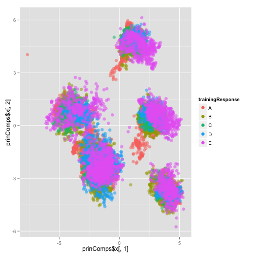
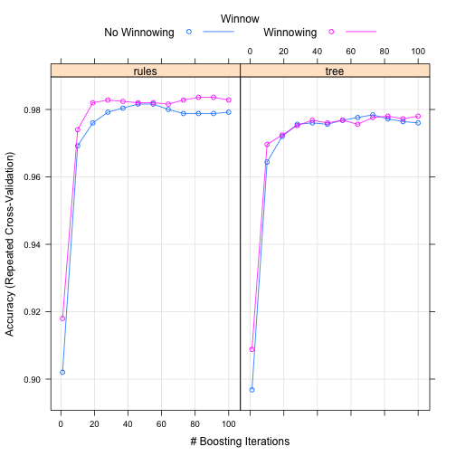
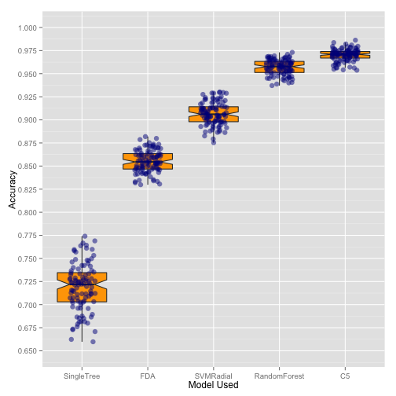

Predicting Correct and Incorrect Exercise Form
========================================================
## Brief Intro
I'm going to try to keep this as succinct as possible, so that I don't end up with 12 pages of output and have to cut it down like I did for the Regression course. So here goes...
<br>
The first thing I did was some very basic data preprocessing. I was prepared to impute missing data, but it turned out that columns were either complete or had more than 97% missing data. This meant deciding which columns to keep was pretty easy, and imputation was not going to be effective.
<br>
After removing the columns with missing info, I  split the data into a test set and a training set.  Later I would split the training set further, so that model optimization would run faster.  I also thought about using principal components, but I would have ended up using 25ish components, instead of 50 predictors.  The increase in model optimization speed from a reduced number of predictors, didn't seem worth the loss of interpretability, so I only used PCA for exploratory analysis.
<br>
I then tried modeling the data using 5 different algorithms. Here they are, along with the tuning parameters they were trained with.<br>
1. Single CART Tree: Complexity Parameter<br>
2. Random Forest: mtry(the number of random predictors available at each split) <br>
3. SVM with a RBF Kernel (sigma and the cost parameter) <br>
4. Flexible Discriminant Analysis with a MARS model as the discriminant function (Number of hinge functions)<br>
5. A C5.0 Boosted Tree/Rules Model (number of trials, winnowed, and trees and rules) <br>

I spent the better part of a day letting those models optimize, and I'd like some of my evening free, so I am only going to run through the C5.0 training process, but the process was nearly identical for all of them.  I used ten-fold CV (repeated in a couple cases), to tune the parameters.  Once the parameters were tuned, I took 100 bootstrap samples, fit a model to each sample, and then measured the out-of-bag accuracy for each. <br>

I then compared these five models using the OOB bootstrap accuracy as a performance indicator, and found that C5.0 performed the best, with the random forest model a close second.  The other 3 models were not as competitive. I provide the bootstrap results of all 5 models, just not the process of training 4 of them. <br>

Since the C5.0 model was the most accurate, I used it to predict the test set that I had created, to again estimate the out-of-sample accuracy, and finally I applied it to the 20 observations in the real test set, and all 20 were predicted correctly. <br>

Before running the final C5.0 model on the Course's test set, I **estimated the test set error** three times.  The first was during the tuning process (10 fold cv).  The second was the average of the 100 bootstrap OOB samples, and the third was on the test set I created.  The errors (1-accuracy) were: **1.8%** , **3.0%**, and **1.1%**  respectively.<br>

Here is the code that I ran from start to finish.  I will ocassionally pop-in for some additional commentary, but hopefully the comments, code, and graphics are explanatory enough. Enjoy! <br>


```r
################# 1. Load packages and Data #################
# Load Packages
library(caret)
```

```
## Loading required package: lattice
## Loading required package: ggplot2
```

```r
library(nnet)
library(kernlab)
library(reshape2)
library(ggplot2)
# Grab Data
setwd("~/Working Directory/JHU/Current Courses/Machine Learning/Project")
fullSet <- read.csv("pml-training.csv",
                        na.strings = c("NA","#DIV/0!"),comment.char="")
```


```r
# Calculate the percent of missing data in each column
percentMissing <- apply(fullSet,2, function(x) sum(is.na(x))/nrow(fullSet))

# Remove columns with no data
fullSet <- fullSet[,-which(percentMissing==1)] 

#Compare Complete Rows to entire data set
fullSetComp <- fullSet[complete.cases(fullSet),]
round(summary(fullSet$classe)/nrow(fullSet),2)
```

```
##    A    B    C    D    E 
## 0.28 0.19 0.17 0.16 0.18
```

```r
round(summary(fullSetComp$classe)/nrow(fullSetComp),2)
```

```
##    A    B    C    D    E 
## 0.25 0.22 0.17 0.16 0.20
```
Before I removed the columns with 95% missing data or more, I wanted to make sure that there wasn't any major correlation between whether data was missing and the mistake classification.  There was not.


```r
#Create dummy variable that indicates if row is complete and check relationship w/ classe
fullSet$complete <- 0
fullSet$complete[complete.cases(fullSet)] <- 1
smr <- multinom(classe~complete,data=fullSet)
```

```
## # weights:  15 (8 variable)
## initial  value 31580.390718 
## iter  10 value 31163.416906
## final  value 31153.823543 
## converged
```

```r
zscore <- summary(smr)$coefficients/summary(smr)$standard.errors
p <- (1 - pnorm(abs(zscore), 0, 1)) * 2
p
```

```
##   (Intercept) complete
## B           0   0.1755
## C           0   0.6014
## D           0   0.5865
## E           0   0.3056
```

```r
rm(list=c("p","zscore","smr"))
```


```r
#Remove predictors with more than 95% missing data
percentMissing <- apply(fullSet,2, function(x) sum(is.na(x))/nrow(fullSet))
sum(percentMissing>0)
```

```
## [1] 94
```

```r
sum(percentMissing>.95)
```

```
## [1] 94
```

```r
fullSet <- fullSet[,-which(percentMissing>0)] 
fullSet$complete  <- NULL
rm(list=c("percentMissing","fullSetComp"))

#Remove time variables and username variable, since not able to generalize
fullSet$X <- NULL
fullSet$user_name <- NULL
fullSet$user_name <- NULL
fullSet$raw_timestamp_part_1 <- NULL
fullSet$raw_timestamp_part_2 <- NULL
fullSet$cvtd_timestamp <- NULL
fullSet$new_window  <- NULL
```

```r
################# 3. Training/Test Set Split #################
set.seed(01134)
trainIndex <- createDataPartition(fullSet$classe, p = .8,list=F)
trainingSet <- fullSet[trainIndex,]
testingSet <- fullSet[-trainIndex,]
trainingResponse <- trainingSet$classe
trainingSet$classe <- NULL
testingResponse <- testingSet$classe
testingSet$classe <- NULL
```

After splitting the data, I considered using principal component analysis to reduce the number of predictors.


```r
################# 4. PCA #################
prinComps <- prcomp(trainingSet,center=TRUE,scale=TRUE)

#Variance Explained
pcaVar <- prinComps$sd^2/sum(prinComps$sd^2)
plot(pcaVar)
```

 

```r
#Visualizing fist two PCAs
plot(x=prinComps$x[,1],y=prinComps$x[,2])
```

 
<br> When I saw that the first two PCAs, split the data into 5 pretty distinct clusters, I got really excited.  But sadly...


```r
ggplot(data=NULL,aes(x=prinComps$x[,1],y=prinComps$x[,2],color=trainingResponse))+
        geom_point(size=3,alpha=0.55)+
        guides(colour = guide_legend(override.aes = list(alpha = 1)))
```

 
<br>Those clusters didn't correspond to the exercise classifications.


```r
################# 4. Modeling #################
#Some models are computationally intensive so using a smaller sample of 2500 rows
set.seed(96757)
redIndex <- sample(1:nrow(trainingSet),size=2500)
trainingSetRed <- trainingSet[redIndex,]
trainingRespRed  <- trainingResponse[redIndex]
#C5.0
trcontrol <- trainControl(method="repeatedcv",
                          number=10,
                          repeats=1,
                          classProbs=FALSE)
c5Grid <- expand.grid(trials=seq(1,100,length=12),
                      model=c("tree","rules"),
                      winnow=c(TRUE,FALSE))

c5Trained <- train(x=trainingSetRed,
                   y=trainingRespRed,
                   method="C5.0",
                   metric="Accuracy",
                   tuneGrid=c5Grid,
                   trControl=trcontrol)
```

```
## Loading required package: C50
## Loading required package: plyr
```

```r
c5Trained
```

```
## C5.0 
## 
## 2500 samples
##   53 predictors
##    5 classes: 'A', 'B', 'C', 'D', 'E' 
## 
## No pre-processing
## Resampling: Cross-Validated (10 fold, repeated 1 times) 
## 
## Summary of sample sizes: 2251, 2252, 2249, 2249, 2251, 2249, ... 
## 
## Resampling results across tuning parameters:
## 
##   model  winnow  trials  Accuracy  Kappa  Accuracy SD  Kappa SD
##   rules  FALSE   1       0.9       0.9    0.02         0.03    
##   rules  FALSE   10      1         1      0.01         0.01    
##   rules  FALSE   20      1         1      0.01         0.02    
##   rules  FALSE   30      1         1      0.01         0.01    
##   rules  FALSE   40      1         1      0.01         0.02    
##   rules  FALSE   50      1         1      0.01         0.02    
##   rules  FALSE   60      1         1      0.01         0.01    
##   rules  FALSE   60      1         1      0.01         0.02    
##   rules  FALSE   70      1         1      0.01         0.02    
##   rules  FALSE   80      1         1      0.01         0.01    
##   rules  FALSE   90      1         1      0.01         0.01    
##   rules  FALSE   100     1         1      0.01         0.01    
##   rules  TRUE    1       0.9       0.9    0.03         0.04    
##   rules  TRUE    10      1         1      0.02         0.02    
##   rules  TRUE    20      1         1      0.01         0.02    
##   rules  TRUE    30      1         1      0.01         0.02    
##   rules  TRUE    40      1         1      0.01         0.02    
##   rules  TRUE    50      1         1      0.01         0.02    
##   rules  TRUE    60      1         1      0.01         0.02    
##   rules  TRUE    60      1         1      0.01         0.02    
##   rules  TRUE    70      1         1      0.01         0.01    
##   rules  TRUE    80      1         1      0.01         0.01    
##   rules  TRUE    90      1         1      0.01         0.02    
##   rules  TRUE    100     1         1      0.01         0.02    
##   tree   FALSE   1       0.9       0.9    0.02         0.03    
##   tree   FALSE   10      1         1      0.02         0.02    
##   tree   FALSE   20      1         1      0.01         0.02    
##   tree   FALSE   30      1         1      0.02         0.02    
##   tree   FALSE   40      1         1      0.01         0.02    
##   tree   FALSE   50      1         1      0.01         0.02    
##   tree   FALSE   60      1         1      0.01         0.01    
##   tree   FALSE   60      1         1      0.01         0.02    
##   tree   FALSE   70      1         1      0.01         0.02    
##   tree   FALSE   80      1         1      0.01         0.01    
##   tree   FALSE   90      1         1      0.01         0.02    
##   tree   FALSE   100     1         1      0.01         0.01    
##   tree   TRUE    1       0.9       0.9    0.03         0.04    
##   tree   TRUE    10      1         1      0.01         0.02    
##   tree   TRUE    20      1         1      0.02         0.02    
##   tree   TRUE    30      1         1      0.01         0.02    
##   tree   TRUE    40      1         1      0.02         0.02    
##   tree   TRUE    50      1         1      0.01         0.02    
##   tree   TRUE    60      1         1      0.01         0.01    
##   tree   TRUE    60      1         1      0.01         0.01    
##   tree   TRUE    70      1         1      0.01         0.01    
##   tree   TRUE    80      1         1      0.01         0.02    
##   tree   TRUE    90      1         1      0.01         0.02    
##   tree   TRUE    100     1         1      0.01         0.02    
## 
## Accuracy was used to select the optimal model using  the largest value.
## The final values used for the model were trials = 82, model = rules
##  and winnow = TRUE.
```

```r
plot(c5Trained)
```

 

```r
trcontrolFin <- trainControl(method="boot",
                             number=100,
                             classProbs=FALSE)
c5GridFin <- expand.grid(trials=c5Trained$bestTune$trials,
                         model=c5Trained$bestTune$model,
                         winnow=c5Trained$bestTune$winnow)
set.seed(571428)
c5TrainedFin <- train(x=trainingSetRed,
                      y=trainingRespRed,
                      method="C5.0",
                      tuneGrid=c5GridFin,
                      metric="Accuracy",
                      trControl=trcontrolFin)
c5TrainedFin
```

```
## C5.0 
## 
## 2500 samples
##   53 predictors
##    5 classes: 'A', 'B', 'C', 'D', 'E' 
## 
## No pre-processing
## Resampling: Bootstrapped (100 reps) 
## 
## Summary of sample sizes: 2500, 2500, 2500, 2500, 2500, 2500, ... 
## 
## Resampling results
## 
##   Accuracy  Kappa  Accuracy SD  Kappa SD
##   1         1      0.007        0.008   
## 
## Tuning parameter 'trials' was held constant at a value of 82
## 
## Tuning parameter 'model' was held constant at a value of rules
## 
## Tuning parameter 'winnow' was held constant at a value of TRUE
## 
```

The file "modelsPML" contains the other 4 bootstrapped results, so to save time I'm going to load that file rather than sit and wait for 4 more models to re-optimize, while I read A Dance with Dragons.


```r
load("modelsPML")
```


```r
resamps <- resamples(modelsPML)
summary(resamps)
```

```
## 
## Call:
## summary.resamples(object = resamps)
## 
## Models: C5, FDA, RandomForest, SingleTree, SVMRadial 
## Number of resamples: 100 
## 
## Accuracy 
##               Min. 1st Qu. Median  Mean 3rd Qu.  Max. NA's
## C5           0.954   0.967  0.971 0.970   0.974 0.986    0
## FDA          0.830   0.847  0.855 0.855   0.863 0.882    0
## RandomForest 0.937   0.951  0.958 0.957   0.963 0.973    0
## SingleTree   0.660   0.703  0.722 0.719   0.735 0.774    0
## SVMRadial    0.875   0.898  0.906 0.907   0.914 0.930    0
## 
## Kappa 
##               Min. 1st Qu. Median  Mean 3rd Qu.  Max. NA's
## C5           0.942   0.958  0.963 0.962   0.967 0.983    0
## FDA          0.786   0.807  0.817 0.818   0.828 0.851    0
## RandomForest 0.920   0.939  0.946 0.946   0.954 0.966    0
## SingleTree   0.572   0.624  0.649 0.646   0.665 0.714    0
## SVMRadial    0.842   0.871  0.881 0.882   0.892 0.911    0
```
Next I created a boxplot of the OOB Bootstrap Accuracies, along with the individual OOB accuracies.  The notches represent a 95% confidence interval.


```r
accGrid <- data.frame(matrix(ncol = 0, nrow = 100))
for (i in 1:length(modelsPML)){
        accGrid <- cbind(accGrid,modelsPML[[i]]$resample$Accuracy)
        
}
colnames(accGrid) <- names(modelsPML[1:length(modelsPML)])

accGrid <- accGrid[,order(colMeans(accGrid,na.rm=T))]
accMelt <- melt(accGrid,id=NULL)
modelfit <- ggplot(data=accMelt,aes(x=variable,y=value))+
        geom_boxplot(fill="orange",notch=T,outlier.size=0)
modelfit+geom_point(position=position_jitter(w = 0.2),size=3,color="darkblue",alpha=0.5)+ylab("Accuracy")+xlab("Model Used")+
        scale_y_continuous(limits=c(.65,1),breaks=seq(0.65,1,by=0.025))
```

 
<br>So as you can see, C5.0 performed the best and I will therefore use it as my final prediction model.

```r
#C5.0 Predictions My Test Set
testPreds <- predict(c5TrainedFin,testingSet)
```

```
## Loading required package: C50
## Loading required package: plyr
```

```r
postResample(testPreds,testingResponse)
```

```
## Accuracy    Kappa 
##   0.9890   0.9861
```

```r
confusionMatrix(testPreds,testingResponse)
```

```
## Confusion Matrix and Statistics
## 
##           Reference
## Prediction    A    B    C    D    E
##          A 1112   10    0    0    0
##          B    4  740    1    3    1
##          C    0    3  681    3    0
##          D    0    4    2  633    6
##          E    0    2    0    4  714
## 
## Overall Statistics
##                                         
##                Accuracy : 0.989         
##                  95% CI : (0.985, 0.992)
##     No Information Rate : 0.284         
##     P-Value [Acc > NIR] : <2e-16        
##                                         
##                   Kappa : 0.986         
##  Mcnemar's Test P-Value : NA            
## 
## Statistics by Class:
## 
##                      Class: A Class: B Class: C Class: D Class: E
## Sensitivity             0.996    0.975    0.996    0.984    0.990
## Specificity             0.996    0.997    0.998    0.996    0.998
## Pos Pred Value          0.991    0.988    0.991    0.981    0.992
## Neg Pred Value          0.999    0.994    0.999    0.997    0.998
## Prevalence              0.284    0.193    0.174    0.164    0.184
## Detection Rate          0.283    0.189    0.174    0.161    0.182
## Detection Prevalence    0.286    0.191    0.175    0.164    0.184
## Balanced Accuracy       0.996    0.986    0.997    0.990    0.994
```
According to my test set, C5.0 model has an accuracy of over 98.9%.  This is slightly higher than the OOB estimate from the bootstrapping process.


```r
#Predictions on Actual Test Set
actualTestSet <- read.csv("pml-testing.csv")
actualTestPreds <- predict(c5TrainedFin,actualTestSet)
answers <- actualTestPreds
answers
```

```
##  [1] B A B A A E D B A A B C B A E E A B B B
## Levels: A B C D E
```

All those answers proved to be correct, so I was happy.  If this were a real consulting project and I was receiving an adequately-sized paycheck for writing this, I'd do some more analysis on variable importance, make an attempt at explaining how the boosted C5.0 rules model works, and maybe even proof-read what I've written.  But sadly I'm not, so I'm going to call this sufficient, and bury my nose back in A Dance with Dragons. Thanks for reading!
